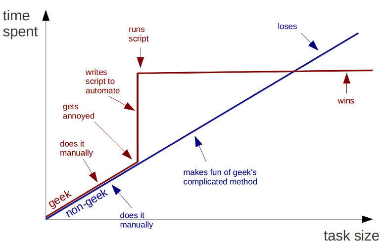
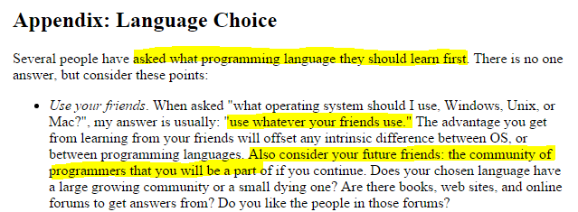

## Sumário

- Objetivos

- Motivação

- Alternativas

- R

- Exemplos

- Próximos Passos

## Objetivos

- **Coleta**

- Limpeza

- **Análise**
    - *Transformação/Manipulação*
    - *Visualização*
    - *Modelagem*

- Insight

- **Comunicação**

Fonte: [The Grammar and Graphics of Data Science](https://github.com/rstudio/webinars/blob/master/01-Grammar-and-Graphics-of-Data-Science/1-dplyr-tidyr.pdf)

<div class="notes">

- As etapas acima são apenas uma representação estática e não conseguem capturar a natureza dinâmica do processo e o itenso feedback que existe entre seus componentes

- Passamos a maior parte do tempo na etapa de transformação/manipulação, antes de atacar as outras etapas, precisamos maximizar essa

 Exemplos
- Coleta: consulta armazém; consulta SQL; planilhas SEF
- Limpeza: espaços entre nomes UO´s; alocação além crédito mês correto
- Transformação/Manipulação: tabela dinâmica
- Visualização: escolha valor base 
- Modelagem: eventos e índices da despesa de pessoal
- Análise/Insight: produção de entendimento sobre o mundo; rigidez orçamentária
- Comunicação: apresentação JPOF

 Objetivos
- Gerar informação confiável, de forma eficiente e estruturada
    - Consistência dos dados e dos cálculos verificada por padrão (testes automáticos)
    - Resultados reprodutíveis com mínima dependência humana
    - Procedimentos de cálculo registrados, com controle de versão
    - Automatização: elimina oportunidade de erros.
- Criar ambiente de análise de dados
    - Permitir que interessados tirem suas próprias conclusões dos dados, de forma dinâmica e interativa
- Diminuir o atrito entre as etapas do processo de análise de dados (ex: (1) agendamento de consulta no armazem entre coleta e análise e (2) qlikview entre análise e comunicação )

</div>

## Adicionando complexidade ao processo de análise de dados


## Motivação 1 - Vício em Planilhas

- O vício é o uso persistente de uma substância que causa prejuízo ao viciado e aos que com ele convivem.

- Não é a substância que causa o prejuízo - seu uso limitado pode ser beneficente. São as circunstâncias e a extensão do uso que determinam se o comportamento caracteriza vício ou não.

- Planilhas são uma invenção fenômenal - caso seu uso seja limitado as situações para as quais ela foi concebida.

Fonte: [Spreadsheet Addiction](http://www.burns-stat.com/documents/tutorials/spreadsheet-addiction/)

<div class="notes">

- O uso da palavra vício neste slide não é uma metáfora.

- Usamos excel para armazenamento de banco de dados, para gerenciamento de banco de dados, para exploração de dados, para análise de dados, para documentação de dados ,para apresentação de dados, para compartilhamento de dados, etc 
</div>

## Motivação 2 - Automatização



<div class="notes">
- eficiencia na execução do processo
- diminuição do número de erros decorrentes de intervenção manual
</div>

## Motivação 3 - Reprodutibilidade

- Replicabilidade (Replicável) *versus* Reprodutibilidade (Reprodutível) na pesquisa científica

- Replicabilidade - Mesmas descobertas científicas utilizando investigadores, métodos, dados, equipamentos e protocolos independentes

- Reprodutibilidade - Mesmas descobertas científicas utilizando investigadores independentes porém os mesmos métodos, dados, equipamentos e protocolos 

- A replicabilidade algumas vezes pode ser impossivel de ser obtida, a reprodutibilidade é um padrão mínimo que podemos garantir

Fonte: [Reproducible research and Biostatistics](http://biostatistics.oxfordjournals.org/content/10/3/405.full)

<div class="notes">

- Replicabilidade na reestimativa - SEF e SEPLAG chegam no mesmo número para o déficit usando processos e metodologias diferentes

- Reprodutibilidade - SEF consegue reproduzir o número do déficit da SEPLAG usando o mesmo processo e metodologia 
</div>

## Motivação 4 - Computação e Software

- Software is eating the word!!!

- Regra de Dedo - Se você está tentando resolver um problema, e existem diversas empresas bilionárias cujo modelo de negócio inteiro depende de resolver o mesmo problema, e existem cursos inteiros na sua universidade dedicados a resolver esse problema, talvez seja uma boa idéia descobrir o que os especialistas fazem e ver se você não pode aprender uma coisa ou outra com eles.

Fonte: [Code and Data for the Social Sciences: A Practitioner´s Guide](http://faculty.chicagobooth.edu/matthew.gentzkow/research/CodeAndData.pdf)

<div class="notes">

- excel é uma habilidade necessária (no sentido lógico, ou seja, a ausência garante que vc não consegue trabalhar em alto nível mas a sua presença não garante que vc conseguirá) para trabalhadores de escritório. Programação/Computação está virando uma habilidade necessária para trabalhadores que fazem análise de dados

- software nós proporciona a habilidade de criar abstrações para diminuir a complexidade, no entanto ela ainda está presente e precisamos aprender a lidar com elas
</div>

## E agora José?

- Assumindo que a gente concorda com as motivações apresentadas, qual o caminho a partir daqui?

- Utilizar planilhas no mini-mundo para que elas foram concebidas, automatizar as tarefas que podem ser automatizadas, utilizar práticas e ferramentas que tornem nossas análises reproduziveis e aprender com a indústria do software como solucionar nossos problemas 

## Alternativas

- **Vício em Planilhas**: R; QlikView; Access

- **Automatização** e **Reproducibility**: Scripting; Programação Literária

- **O Mundo do Software**: Controle de Versão; Teste Unitário; Programação em Pares; Padrões de Projeto

##

## Por que R?


Fonte: [The Popularity of Data Analysis Software](http://r4stats.com/articles/popularity/)

## Por que R?



Fonte: [Teach Yourself Programming in Ten Years](http://norvig.com/21-days.html)

## Por que R?


Fonte: [StackOverflow](http://stackoverflow.com/questions/28800583/extract-ets-method-used-for-automatic-forecasts-of-hierarchical-time-series-with)

## Seeing Is Believing


## Próximos Passos

- Abordagem ágil no gerenciamento de projetos de software

- Desenvolvimento de um pacote no R (`relatorios`) de forma incremental

- Estrutura base das funções

```{r, eval=FALSE}
relatorio(base_rec, base_desp, 
       formato=c("base","relatorio","valor"), 
       export=c("r","excel", "pdf"), ...) {
 ...   
}
```


<div class="notes">
- Abordagem que valoriza software funcionando no lugar de documentação extensiva e resposta a mudança no lugar de seguir um plano

- Iniciar pelo pacote reestRelatorios tendo em vista que sua complexidade de negócio é relativamente simples, deixando tempo suficiente para a equipe do projeto maturar o conhecimento em relação ao ambiente de desenvolvimento
</div>
